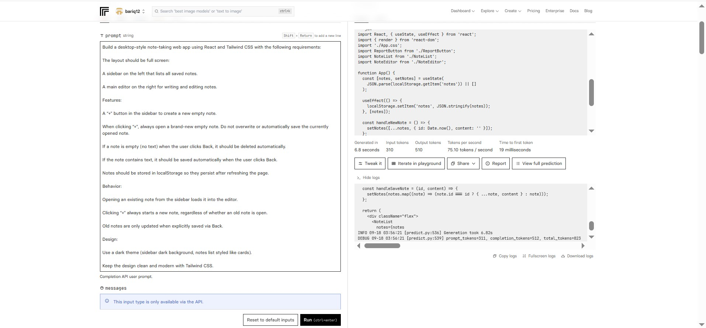

# 📝 Notepad Web App

## 📌 Project Title
Notepad Web App

---

## 📖 Description
Aplikasi web sederhana seperti **notepad** untuk membuat, mengedit, dan menghapus catatan.  
Dibangun menggunakan **React** dan **Tailwind CSS**, aplikasi ini menyimpan catatan di **localStorage** sehingga tetap tersedia meskipun halaman direfresh.  
Desain menggunakan **dark mode** dengan tampilan desktop modern dan clean.

---

## 🛠 Technologies Used
- **React.js** → Library untuk membangun antarmuka pengguna.  
- **Tailwind CSS** → Framework CSS untuk styling modern & responsif.  
- **LocalStorage** → Menyimpan data catatan di browser.  

---

## ✨ Features
- **Full screen layout** dengan sidebar daftar catatan dan editor.  
- Tombol **Tambah (+)** untuk membuat catatan baru kosong.  
- **Auto-delete** → jika catatan kosong saat klik *Back*, catatan akan otomatis terhapus.  
- **Auto-save** → jika catatan memiliki teks, otomatis tersimpan saat klik *Back*.  
- Catatan lama tidak tertimpa ketika membuat catatan baru.  
- Tema **dark mode** dengan desain clean.  

---

## 🚀 Setup Instructions
- **AI yang digunakan:** IBM Granite Instruct  
- **Alat deploy:** Vercel  

---

## 🤖 AI Support Explanation
Project ini juga didukung dengan **IBM Granite Instruct**, salah satu model AI open-source yang berguna untuk:  
- Menjelaskan kode dan alur program.  
- Memberikan saran optimalisasi struktur project.  
- Membantu menulis dokumentasi seperti README.md ini.  
- Menyediakan contoh kode tambahan untuk fitur baru.  

### 📷 Screenshot
Berikut tampilan representasi AI Support menggunakan IBM Granite Instruct:  

